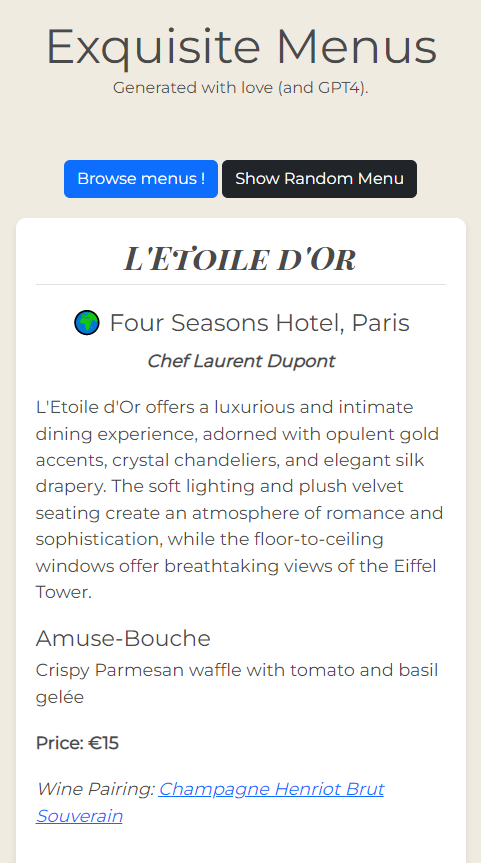

# Exquisite Menus 🍽️ 🥂



Welcome to Exquisite Menus, the elegant tasting menu website that displays the culinary masterpieces from world-class restaurants. With a fancy yet light and modern design, our platform showcases the most enticing dishes and wine pairings, creating a delightful experience for food enthusiasts.

## Features 🌟

- 🍛 Beautifully designed menu cards for a delightful user experience
- 📜 Dynamic rendering of JSON menu data
- 💻 Responsive design that looks great on both desktop and mobile devices
- 🍷 Detailed wine pairings for each dish on the menu
- 🌐 Easily expandable to showcase multiple menus

## How to use 🚀

1. Clone or download the repository.
2. Place your JSON menu data in the `menuData.js` file, following the provided example structure.
3. Open `index.html` in your browser to see the magic happen!

## JSON menu data structure 📚

Here is an example of the JSON structure that the website expects:

```json
{
  "location": "Four Seasons Hotel, Paris",
  "restaurant_name": "L'Etoile d'Or",
  "chef_name": "Chef Laurent Dupont",
  "tasting_menu": [
    {
      "course": "Amuse-Bouche",
      "description": "Crispy Parmesan waffle with tomato and basil gelée",
      "price": 15,
      "wine_pairing": "Champagne Henriot Brut Souverain"
    },
    ...
  ],
  "grand_total": 250,
  "dining_room_description": "L'Etoile d'Or offers a luxurious and intimate dining experience, adorned with opulent gold accents, crystal chandeliers, and elegant silk drapery. The soft lighting and plush velvet seating create an atmosphere of romance and sophistication, while the floor-to-ceiling windows offer breathtaking views of the Eiffel Tower."
}
```

Feel free to add as many menus as you'd like to the menuData array in the menuData.js file.

## Contributing 🤝
We welcome contributions! If you have ideas for improvements or new features, feel free to open an issue or submit a pull request.

## License 📄
Exquisite Menus is released under the MIT License. See LICENSE for more information.
